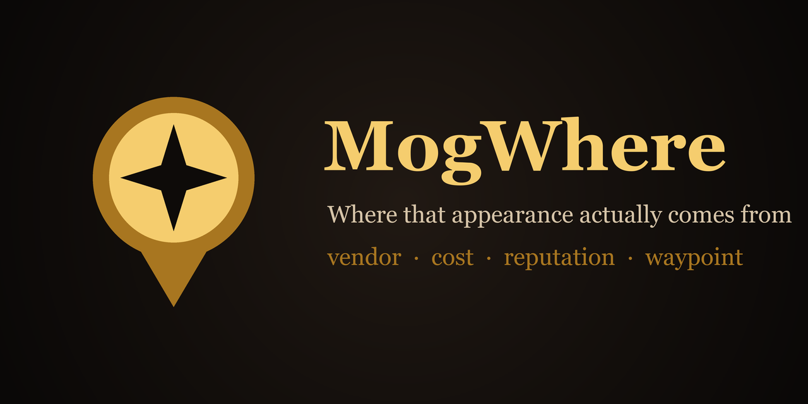
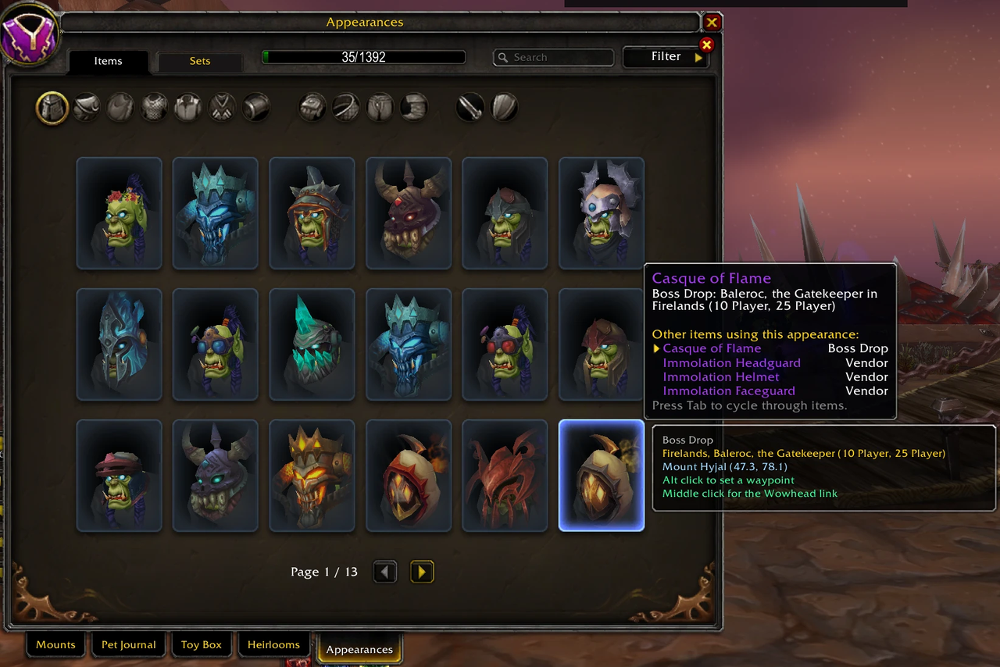
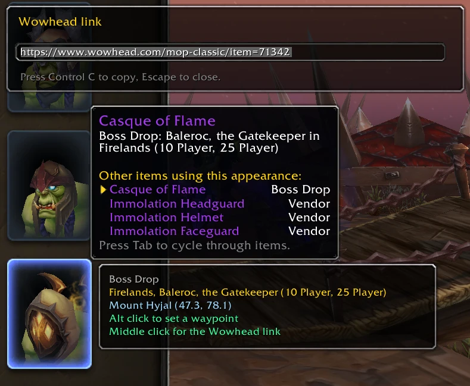
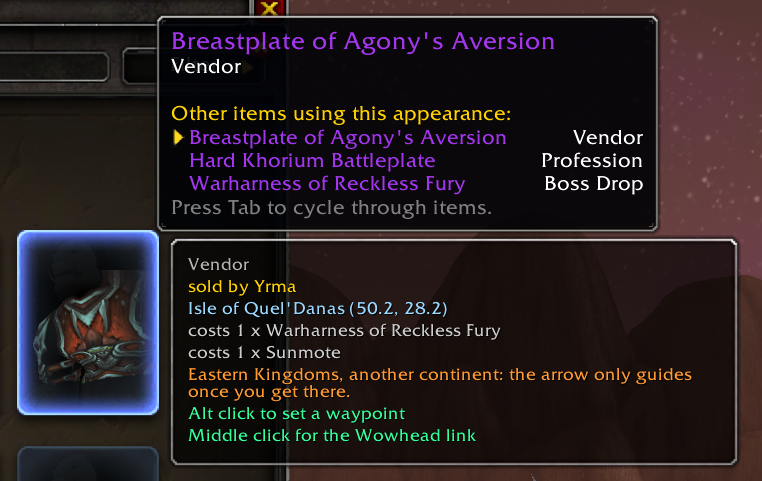
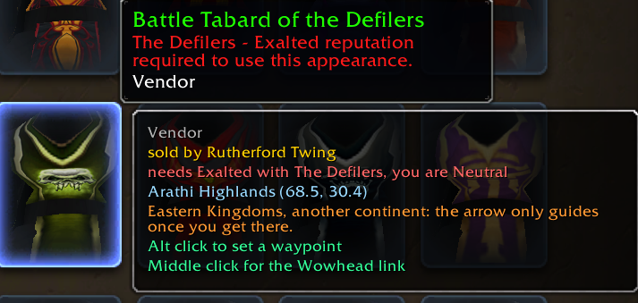
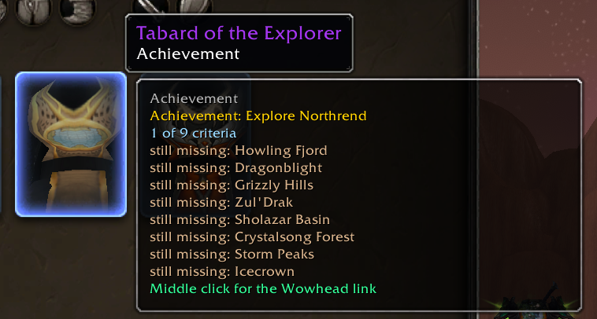
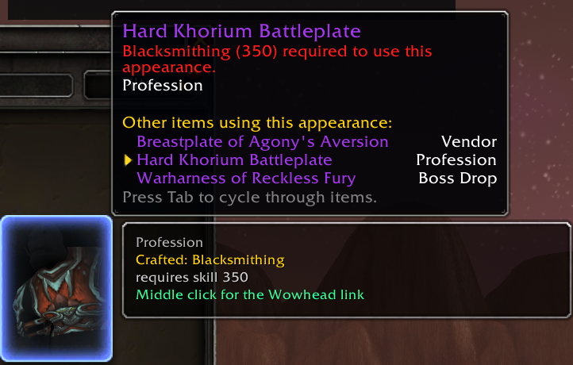
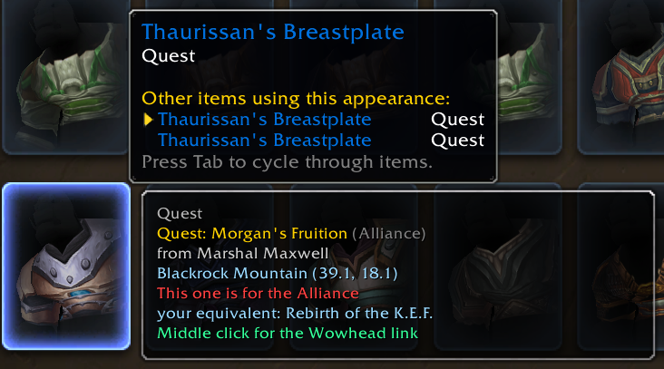
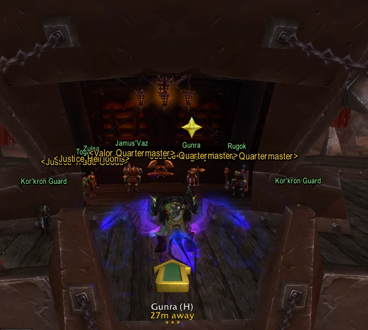

# MogWhere

**The Appearances tab gives you one word. "Vendor". "Quest". "Boss Drop".
"Achievement". Then nothing.**

Not which vendor, or what it charges. Not which quest, or who hands it out. Not
which boss, in which instance, on which difficulty. Not which achievement, or how
far along you already are. And never whether you have the reputation for any of
it.

**MogWhere answers all of that, in the wardrobe itself.**

Hover any tile in the wardrobe. A panel appears next to it with the real answer,
in your language, following the client's own Tab selection.

  <strong>DOWNLOAD THE ADDON</strong>

  <a href="https://www.curseforge.com/wow/addons/mogwhere-find-transmog-appearance-sources-and"><strong>CurseForge</strong></a>
  &nbsp;&middot;&nbsp;
  <a href="https://github.com/Mouchoir/mogwhere/releases/latest"><strong>Latest release on GitHub</strong></a>

---

## What it looks like

- **The whole thing lives in the Appearances tab.** Hover a tile, read the answer.

  

- **A boss drop** with the instance, the boss and every difficulty it can drop on, next to the Wowhead link that middle click just copied.

  

- **A vendor**, named, with the zone, coordinates and both item costs. The orange line is the warning you get before clicking, because TomTom cannot give a bearing across an ocean.

  

- **A reputation gate**, answered with both halves: what it needs and where you actually stand.

  

- **An achievement**, with your own live progress and the criteria you are still missing. Not the ones you already have, which are a trophy rather than a to do list. Read entirely from the client.

  

- **A crafted appearance**, with the recipe and the skill level it needs.

  

- **A quest that exists once per faction.** The other side's version says so, and names the one you can actually do.

  

- **The star**, on the nameplate of the vendor you asked to be taken to. It clears itself once you talk to them.

  

---

## What it shows

**Boss drops** get the instance, the boss and every difficulty it can drop on.
Not the first difficulty, all of them, because "Blackwing Descent, Maloriak (10
Player, 25 Player)" and "10 Player" send you to different raids.

**Vendors** get the vendor's name, the zone, coordinates to one decimal, and the
price, whether that is gold, a currency or another item. Item and currency names
are resolved and shown as names, never as ids.

**Quests** get the quest title and the name of whoever hands it out.

**Professions** get the recipe, the skill level it needs, and where the recipe
itself comes from when it has to be looted rather than bought.

**Achievements** get the achievement name, its description, and your own live
progress, listing the criteria you are still missing rather than the ones you
already have. This part is read entirely from the client, so it works with no
dependency at all.

**Reputation gates** are answered with both halves: what the item requires and
where you currently stand. "Needs Exalted with The Defilers, you are Neutral",
in green when you have already made it.

**Faction differences** are handled the way a player thinks about them. An
appearance sold by both a Horde and an Alliance quartermaster simply shows yours.
An appearance that exists as two separate faction quests shows the one you can
do, and names the equivalent when you are looking at the other side's.

## What it does

**Alt click** sets a TomTom waypoint, on your own faction's vendor, titled with
what you are going for rather than the city you are standing in.

**Middle click** opens the Wowhead link for the item, on the right game version
and in the right language. The URL is built from `WOW_PROJECT_ID` and
`GetLocale()`, so a French Mists Classic client gets
`wowhead.com/mop-classic/fr/item=...`.

**A star** appears over the nameplate of the vendor you are heading to, and
clears itself once you actually talk to them.

**When the destination is on another continent**, it says so before you click,
because TomTom's arrow gives no bearing across an ocean and an arrow that
silently does nothing reads as a broken addon.

## Commands

| Command | What it does |
|---|---|
| `/mw options` | options panel, and a standing reminder of any missing optional addon |
| `/mw quiet` | silence the AllTheThings interface, without touching its settings |
| `/mw nameplate` | toggle the star on the target's nameplate |
| `/mw deps` | the optional addons you are missing, with links |
| `/mw reset` | clears harvested data |

There are three more, `/mw status`, `/mw census` and `/mw probe`, plus
`/mw debug`. They exist for diagnosing the addon rather than playing the game,
and nothing asks you to run them.

---

## How it works, and why it needs help

A WoW addon has **no network access**. None. So "look up the source" can only
ever mean one of two things: read it from the running client, or ship it in the
package. MogWhere does both, in three layers, in decreasing order of trust.

### Layer 1: the client

More generous than the interface suggests.
`C_TransmogCollection.GetAppearanceSourceDrops` returns the instance, the boss
and the difficulties, already localized. `GetSourceRequiredHoliday` covers
seasonal items. Achievements, their criteria and your progress are all live.
Reputation and level gates are read off the item tooltip, matched through the
client's own `ITEM_REQ_REPUTATION` format string so it works in every language
without a translation table of ours.

This layer ships no data and can never go stale.

### Layer 2: [AllTheThings](https://www.curseforge.com/wow/addons/all-the-things)

ATT carries the three things the client withholds: which NPC sells an item, what
it costs, and where that NPC stands. Its database is read at runtime through the
`ATTC` global it deliberately exports, and never copied into this addon.

**It is optional, and it is also where most of the answers come from.** Without
it MogWhere still answers every boss drop, every achievement and every reputation
gate on its own, and says plainly what it cannot answer. With it, most of the
wardrobe gets a real address.

### Layer 3: harvesting

Every merchant window is a free data dump: the items, the gold price, the
currency and item costs, the vendor's name and your coordinates. It fills gaps
and it is how vendor names get learned.

What it cannot do is answer "where do I find something I have never seen",
because by definition you would have had to find the vendor already. So it is a
gap filler, never a pillar, and it never asks anything of you.

---

## Optional addons

Both are declared as `OptionalDeps`. MogWhere loads and works without either, and
tells you in the panel exactly what each one would add.

| Addon | What it adds to MogWhere |
|---|---|
| [AllTheThings](https://www.curseforge.com/wow/addons/all-the-things) | vendors, quest givers, costs and coordinates. Without it, only boss drops are located. |
| [TomTom](https://www.curseforge.com/wow/addons/tomtom) | turns a location into an arrow you can follow. Without it, you still get the zone and coordinates. |

If one is installed but switched off, MogWhere says so and offers to enable it
and reload, rather than telling you to download something you already have.

---

## Compatibility

Mists of Pandaria Classic only, for now. There is a single
`MogWhere_Mists.toc` and no retail build yet. The client layer is portable, but
retail changes enough of the reputation model and the wardrobe utilities that a
port deserves to be measured rather than assumed.

## Building and contributing

`scripts/dev.ps1` copies the addon into every client listed in
`scripts/dev.local.ps1`, which is gitignored and holds machine paths only. It
skips any client there is no matching `.toc` for.

Lua is validated with `luacheck addon/MogWhere`, which must stay at zero
warnings. That gate runs on every push and again before any release.

### Releasing

Tag it. `git tag -a v0.2.0 -m "..." && git push --follow-tags` runs
`.github/workflows/release.yml`, which lints, packages through
[BigWigsMods/packager](https://github.com/BigWigsMods/packager) using `.pkgmeta`,
substitutes `@project-version@` in the toc from the tag, and attaches the zip to
a GitHub release.

Uploading to CurseForge on top of that needs two more things, neither of which
exists until the project does: a `CF_API_KEY` repository secret, and a
`## X-Curse-Project-ID:` line in the toc. Without them the workflow still builds
and publishes the GitHub release, so nothing is blocked in the meantime.

## Privacy

`MogWhereDB` holds vendor inventories, coordinates and resolved NPC names, which
are facts about the game world rather than about you. It records no character
names, no gold and no social data. The SavedVariables file is gitignored
regardless.

---

## My other World of Warcraft addons

Same idea behind all of them: a small thing the interface makes tedious, done
once and properly.

**[Party Role Icons](https://www.curseforge.com/wow/addons/party-role-icons-display-group-roles)**
puts tank, healer and damage icons on the player and party portraits, retail
style, including in groups you put together by hand.

**[Timeless Question Autocomplete](https://www.curseforge.com/wow/addons/timeless-question-autocomplete)**
answers Senior Historian Evelyna's daily lore question for you, in any game
language.

**[Darkmoon Faire Buff](https://www.curseforge.com/wow/addons/darkmoon-faire-buff-dfb)**
automates Sayge's Darkmoon Faire buff dialogue, so a weekly buff stops being a
menu you click through from memory.

**[Hardcore Congrats](https://www.curseforge.com/wow/addons/hardcore-congrats)**
congratulates Hardcore players reaching level 60, automatically.

**[One Click Enchant](https://github.com/Mouchoir/OneClickEnchant)** creates
enchantment scrolls with a single click.
